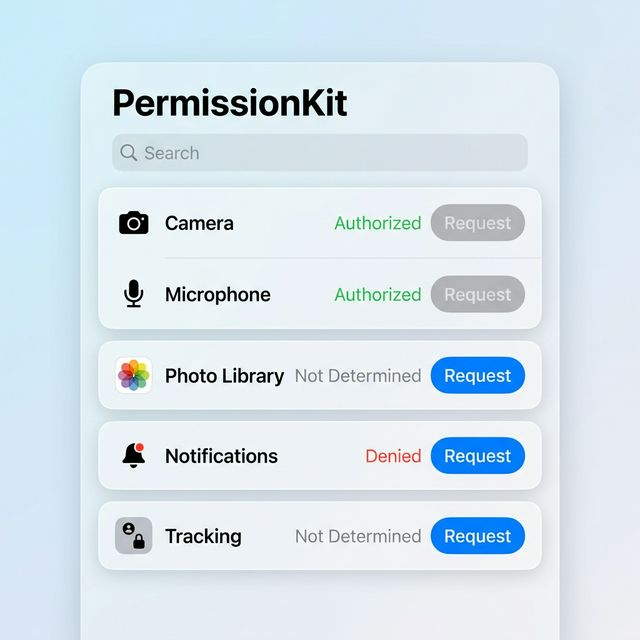

[](https://swiftpackageindex.com/ErsanQ/PermissionKit)
[](https://swiftpackageindex.com/ErsanQ/PermissionKit)
# PermissionKit

A modern, Swift-concurrency-ready approach to handling permissions on iOS and macOS.



## Features
- **Async/Await**: Built-in support for Swift concurrency.
- **Thread Safe**: Core logic handled by `@MainActor`.
- **SwiftUI Integration**: Easy-to-use view extensions.
- **Universal Status**: Simplified `PermissionStatus` enum across all Apple frameworks.

## Supported Permissions
- Camera (AVFoundation)
- Photo Library (Photos)
- Notifications (UserNotifications)
- App Tracking (AppTrackingTransparency)
- Microphone (AVFoundation)

## Installation

Add this package to your `Package.swift` dependencies:

```swift
.package(url: "https://github.com/ErsanQ/PermissionKit", from: "1.0.0")
```

## Setup (Info.plist)

You must add the relevant usage descriptions to your application's `Info.plist`:

| Permission | Key | Description |
|---|---|---|
| **Camera** | `NSCameraUsageDescription` | Explain why your app needs camera access. |
| **Microphone** | `NSMicrophoneUsageDescription` | Explain why your app needs microphone access. |
| **Photo Library** | `NSPhotoLibraryUsageDescription` | Explain why your app needs access to the user's photos. |
| **Tracking** | `NSUserTrackingUsageDescription` | Explain why your app asks for tracking authorization. |

## Usage

### Using SwiftUI Extension

```swift
import PermissionKit
import SwiftUI

struct ContentView: View {
    @State private var showPermission = false
    
    var body: some View {
        Button("Request Camera Access") {
            showPermission = true
        }
        .requestPermission(for: .camera, isPresented: $showPermission) { status in
            print("Status updated: \(status)")
        }
    }
}
```

### Direct Request (Async/Await)

```swift
import PermissionKit

let manager = PermissionManager.shared
let status = await manager.request(for: .camera)

if status == .authorized {
    // Proceed with action
}
```

## Example App
A full implementation example can be found in `Examples/PermissionExampleView.swift`.

## Platform Support
- iOS 14.0+
- macOS 11.0+

## Author
ErsanQ (Member of the Swift Package Index community)
